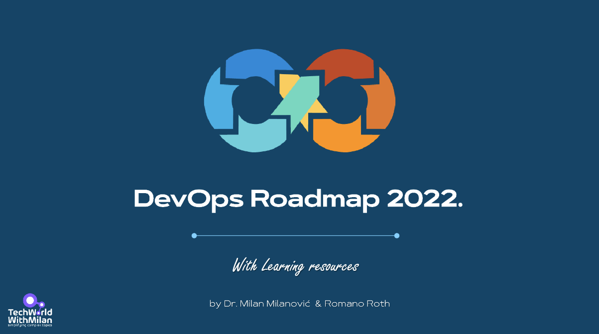
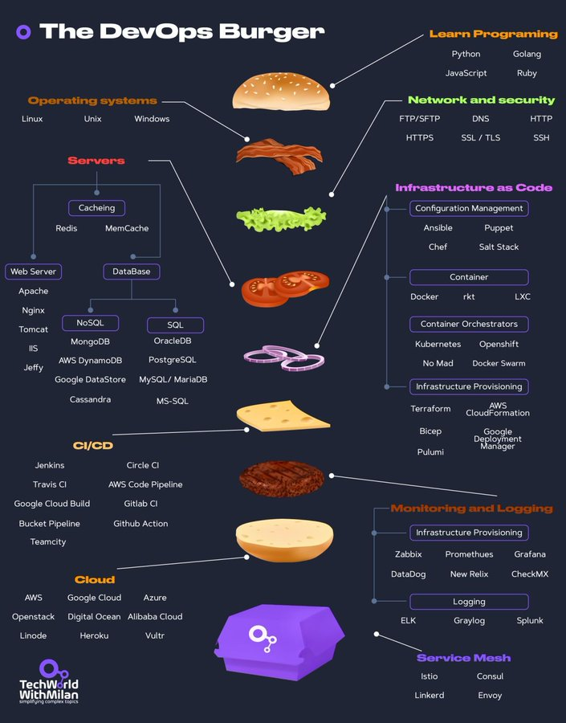

# DevOps Roadmap 2024.

This is a step-by-step guide on how to become a DevOps engineer, with links to relevant learning resources.

If you want to learn more about DevOps, be sure to subscribe to **[my newsletter](https://newsletter.techworld-with-milan.com/)**. 

## Disclaimer

> The purpose of this roadmap is to give you an idea about the landscape. The road map will guide you if you are confused about what to learn next, rather than encouraging you to pick what is hype and trendy. You should grow some understanding of why one tool would be better suited for some cases than the other and remember that hype and trendy do not always mean best suited for the job.

## Give a Star! :star:

If you like or are using this project to learn or start your solution, please give it a star. Thanks!

Download [Version without background](DevOps%20Roadmap%20No%20Background.png).

## PDF version

Download [PDF version](DevOps%20Roadmap.pdf).

## Table of Contents

- [Learning resources for DevOps Engineers (mostly free)](#learning-resources-for-devops-engineers-mostly-free)
  - [1. GIT](#1-git)
  - [2. Learn one programming language](#2-learn-one-programming-language)
  - [3. Learn Linux & Scripting](#3-learn-linux--scripting)
  - [4. Learn Networking & Security](#4-learn-networking--security)
  - [5. Learn Server Management](#5-learn-server-management)
  - [6. Learn Containers](#6-learn-containers)
  - [7. Learn Container Orchestration](#7-learn-container-orchestration)
  - [8. Learn Infrastructure as a code](#8-learn-infrastructure-as-a-code)
  - [9. Learn CI/CD](#9-learn-cicd)
  - [10. Learn Monitoring & Observability](#10-learn-monitoring--observability)
  - [11. Learn one Cloud provider](#11-learn-one-cloud-provider)
  - [12. Learn Software Engineering Practices](#12-learn-software-engineering-practices)
- [Additional resources](#additional-resources)
  - [Tools](#tools)
  - [Books](#books)

## Learning resources for DevOps Engineers (mostly free)

### 1. GIT

All your resources (files) will be held in a GIT repository. Those files are **application code** but also **infrastructure as a code**. 

**Git** is a free tool used for source code management. Git is used to tracking changes in the source code, enabling multiple developers to work together on non-linear development. 

The two most popular Git platforms are **GitLab** and **GitHub**.

Here you need to learn Git commands, like git clone, branch, merge, and how to collaborate on a project with pull requests.

Resources:

- [Pro Git Book](https://git-scm.com/book/en/v2) FREE
- [Learn Git by Atlassian](https://www.atlassian.com/git) FREE
- [Learn Git Branching](https://learngitbranching.js.org/) FREE
- [Learn Git & GitHub on CodeAcademy](https://www.codecademy.com/learn/learn-git) FREE
- [Git Command Explorer](https://gitexplorer.com/) FREE
- [Git Immersion](https://gitimmersion.com/index.html) FREE
- [A Visual Git Reference](http://marklodato.github.io/visual-git-guide/index-en.html) FREE

### 2. Learn one programming language

As an engineer, it is recommended to know at least one programming language that you can use to write **automation scripts**.

Some popular programming languages for DevOps-es are **Python, Go, and JavaScript**.

Python is a multi-paradigm language. Being an interpreted language, code is executed as soon as it is written, and the syntax allows for writing code in different ways. **Python** is frequently recommended as the first language new coders should learn, because of its focus on readability, consistency, and ease of use. 

Here you need to learn basic concepts of programming languages, such as syntax, if/else, loops, data structures, etc.

Resources:

- [Automate the Boring Stuff with Python book](https://automatetheboringstuff.com/) FREE
- [Python Crash Course](https://ehmatthes.github.io/pcc/) FREE
- [The Modern JavaScript Tutorial](https://javascript.info/) FREE
- [JavaScript Crash Course For Beginners](https://www.youtube.com/watch?v=hdI2bqOjy3c) FREE
- [Eloquent JavaScript, 3rd edition](https://eloquentjavascript.net/), Marjin Haverbeke FREE book
- [Go by Example](https://gobyexample.com/) FREE

### 3. Learn Linux & Scripting

An Operating system serves as a bridge between a computer's user and its hardware. Its function is to offer a setting in which a user can conveniently and effectively run programs. 

As most servers use **Linux OS**, you need to make yourself comfortable with Linux and its CLI. 

One easy-to-start distribution is **Ubuntu**. 

In addition, you need to know **scripting** to automate tasks for development and operations. 

Here you can learn OS-specific languages, such as **Bash or Powershell**, or independent, like Python or Go.

Resources:

- [Operating System - Overview](https://www.tutorialspoint.com/operating_system/os_overview.htm) FREE
- [Shell Scripting Tutorial](https://www.shellscript.sh/) FREE
- [Powershell Tutorial for Beginners: Learn Powershell Scripting](https://www.guru99.com/powershell-tutorial.html)  FREE
- [Bash Reference Manual](https://www.gnu.org/savannah-checkouts/gnu/bash/manual/bash.html) FREE
- [Ultimate Guide: Getting Started With Ubuntu](https://itsfoss.com/getting-started-with-ubuntu/) FREE
- [FreeBSD Handbook](https://docs.freebsd.org/en/books/handbook/) FREE
- [Linux command handbook](https://www.freecodecamp.org/news/the-linux-commands-handbook/) FREE

### 4. Learn Networking & Security

A **network protocol** is an established set of rules that determine how data is transmitted between different devices in the same network. Essentially, it allows connected devices to communicate with each other, regardless of any differences in their internal processes, structure, or design. 

Here you will need to know how a network works, how to configure **firewalls**, understand how **DNS** works, **OSI model**, IP addresses, ports, etc.

Resources:

- [OSI Model Explained](https://www.cloudflare.com/en-gb/learning/ddos/glossary/open-systems-interconnection-model-osi/) FREE
- [Computer Networking: A Top-Down Approach](https://www.amazon.com/Computer-Networking-Top-Down-Approach-7th/dp/0133594149) book
- [TCP/IP and Networking Fundamentals for IT Pros](https://www.pluralsight.com/courses/tcpip-networking-it-pros) Pluralsight course
- [DevSecOps : Master Securing CI/CD | DevOps Pipeline](https://www.udemy.com/course/devsecops/) Udemy course
- [Hands-On Security in DevOps: Ensure continuous security, deployment, and delivery with DevSecOps](https://www.amazon.com/Hands-Security-DevOps-continuous-deployment/dp/1788995503)  Book
- [Securing DevOps: Security in the Cloud](https://www.amazon.com/Securing-DevOps-Security-Julien-Vehent/dp/1617294136/)  Book

### 5. Learn Server Management

Server management includes all the infrastructure monitoring and maintenance required for servers to operate reliably and at optimal performance levels. The primary goals of an **effective server management strategy** are to:

- Minimize server slowdowns and downtime while maximizing reliability.
- Build secure server environments.
- Scale servers and related operations to meet the needs of the organization over time.

Here you will need to know what is **forward and reverse proxies**, **caching servers**, and how to operate **Web Servers**, such as Nginx, Apache, or IIS.

Resources:

- [What is a reverse proxy?](https://www.cloudflare.com/en-gb/learning/cdn/glossary/reverse-proxy/) FREE
- [Cache Server](https://networkencyclopedia.com/cache-server/) FREE
- [Reverse Proxy vs. Forward Proxy: The Differences](https://oxylabs.io/blog/reverse-proxy-vs-forward-proxy) FREE
- [What is load balancing?](https://www.cloudflare.com/en-gb/learning/performance/what-is-load-balancing/) FREE
- [What is a Firewall?](https://www.checkpoint.com/cyber-hub/network-security/what-is-firewall/) FREE
- [The NGINX Handbook](https://www.freecodecamp.org/news/the-nginx-handbook/) FREE
- [Learn Apache Server](https://www.twaino.com/en/blog/website-creation/apache-server-2/) FREE
- [Learn IIS](https://www.dnsstuff.com/windows-iis-server-tools) FREE

### 6. Learn Containers

A **container** is a standard unit of software that packages up code and all its dependencies, so the application runs quickly and reliably from one computing environment to another. 

**Docker** is by far the most popular container technology today. A Docker container image is a lightweight, standalone, executable package of software that includes everything needed to run an application: code, runtime, system tools, system libraries, and settings. Here you need to know how to run containers, Docker Networking, Volumes, Dockerfiles, and run multiple containers with Docker-Compose.

Resources:

- [What are Containers?](https://cloud.google.com/learn/what-are-containers) FREE
- [Learning Containers From The Bottom Up](https://iximiuz.com/en/posts/container-learning-path/) FREE
- [Docker Tutorial for Beginners by TechWorld with Nana](https://www.youtube.com/watch?v=3c-iBn73dDE) FREE
- [Docker Mastery: with Kubernetes +Swarm from a Docker Captain](https://www.udemy.com/course/docker-mastery/) Udemy course
- [What is Service Mesh?](https://www.redhat.com/en/topics/microservices/what-is-a-service-mesh) FREE

### 7. Learn Container Orchestration

Container orchestration **automates** the deployment, management, scaling, and networking of containers. 

Container orchestration can be used in any environment where you use containers. It can help you to deploy the same application across different environments without needing to redesign it. And microservices in containers make it easier to orchestrate services, including storage, networking, and security. 

Here you need to learn how **Kubernetes** works, and how to administer the Kubernetes cluster and deploy applications on it. 

Resources:

- [Kubernetes Crash Course for Absolute Beginners by TechWorld with Nana](https://www.youtube.com/watch?v=s_o8dwzRlu4) FREE
- [Primer: How Kubernetes Came to Be, What It Is, and Why You Should Care](https://thenewstack.io/primer-how-kubernetes-came-to-be-what-it-is-and-why-you-should-care/) Article
- [Certified Kubernetes Administrator (CKA) with Practice Tests](https://www.udemy.com/course/certified-kubernetes-administrator-with-practice-tests/) Udemy course
- [Learn Kubernetes - Beginners to Advanced by KodeKloud](https://kodekloud.com/learning-path-kubernetes/) Course
- [Understand when to use Cluster Services, Ingresses or API Gateways](https://gateway-api.sigs.k8s.io) FREE
- [Understand which Problems Service Mesh solve (Use an Abstraction smi-spec.io](https://linkerd.io/2.12/features/) FREE
- [Learn how to automate TLS](https://cert-manager.io/docs/) and  [DNS](https://github.com/kubernetes-sigs/external-dns) FREE
- [Kubernetes Up and Running](https://www.amazon.com/_/dp/1491935677?tag=oreilly20-20) Book
- [Kubernetes Learning Path - 50 days from zero to hero from Microsoft](https://azure.microsoft.com/en-us/resources/kubernetes-learning-path/) FREE

### 8. Learn Infrastructure as a code

Sometimes referred to as **IaC**, it refers to the techniques and tools used to define infrastructure, typically in a markup language like YAML or JSON. Infrastructure as code allows Engineers to automate environment setup and teardown. Accelerates and de-risks deployment by provisioning gold copy environments on demand.

**Terraform** is the most popular infrastructure provisioning tool, but there are others such as Ansible, Chef, Puppet, and Vagrant.

Here you need to know how to do **infrastructure provisioning** and **configuration management**.

Resources:

- [GUIs, CLI, APIs: Learn Basic Terms of Infrastructure-as-Code](https://thenewstack.io/guis-cli-apis-learn-basic-terms-of-infrastructure-as-code/) FREE
- [Official Terraform Tutorials](https://learn.hashicorp.com/terraform) FREE
- [A Comprehensive Guide to Terraform](https://blog.gruntwork.io/a-comprehensive-guide-to-terraform-b3d32832baca) FREE
- [Automate Terraform documentation like a pro!](https://medium.com/google-cloud/automate-terraform-documentation-like-a-pro-ed3e19998808) FREE
- [Writing reusable Terraform modules](https://thomasthornton.cloud/2022/06/02/writing-reusable-terraform-modules/) FREE
- [What is Istio?](https://www.redhat.com/en/topics/microservices/what-is-istio) FREE
- [Puppet overview](https://puppet.com/docs/puppet/latest/puppet_overview.html) FREE
- [Puppet Courses](https://training.puppet.com/) FREE and PAID
- [Getting Started With Ansible](https://docs.ansible.com/ansible/latest/getting_started/) FREE
- [Learning Ansible Basics](https://www.redhat.com/en/topics/automation/learning-ansible-tutorial)
- [Get started with Red Hat Ansible](https://www.ansible.com/resources/get-started) FREE and PAID
- [Mastering Ansible](https://www.udemy.com/course/mastering-ansible/) Udemy Course
- [Learn Chef](https://learn.chef.io/) FREE

### 9. Learn CI/CD

Continuous Integration / Continuous Deployment (CI/CD) is a method to frequently deliver apps to customers by introducing **automation** into the stages of app development. CI/CD is a solution to the problems integrating new code can cause for development and operations teams.

CI/CD introduces continuous automation and **continuous** monitoring throughout the lifecycle of apps, from integration and testing phases to delivery and deployment. These connected practices are often referred to as a "**CI/CD pipeline**" and are supported by development and operations teams.

There are **different stages** of a CI/CD pipeline, such as: **build, test and deploy**, but there could be much more activities included:

- Checking code from version control and building it
- Having staged gates for different kinds of approvals
- Managing environment variables
- Restarting services
- Executing tests
- And more...

Here you need to learn how to set up CI/CD server, integrate code and trigger pipelines automatically, and build and package management tools.

Some **popular CI/CD tools** are Jenkins, TeamCity, CircleCI, Bamboo, GitLab, and Azure DevOps.

Resources:

- [Continuous Integration](https://martinfowler.com/articles/continuousIntegration.html) FREE
- [CI/CD Pipeline: A Gentle Introduction](https://semaphoreci.com/blog/cicd-pipeline) FREE
- [Learn GitLab with tutorials](https://docs.gitlab.com/ee/tutorials/) FREE
- [Get started with GitLab CI/CD](https://docs.gitlab.com/ee/ci/quick_start/) FREE
- [Jenkins, From Zero To Hero: Become a DevOps Jenkins Master](https://www.udemy.com/course/jenkins-from-zero-to-hero) Udemy course
- [Learn GitHub actions](https://learn.microsoft.com/en-us/users/githubtraining/collections/n5p4a5z7keznp5) FREE
- [Workflow syntax for GitHub Actions](https://docs.github.com/en/actions/using-workflows/workflow-syntax-for-github-actions) FREE
- [Learn Azure DevOps](https://milan.milanovic.org/post/ci-cd-with-azure-devops-yaml/) FREE
- [GitLab Cheatsheets](https://dev.to/jphi_baconnais/series/12928) FREE

### 10. Learn Monitoring & Observability

Monitoring entails overseeing the entire development process from planning, development, integration and testing, deployment, and operations. It involves a complete and **real-time view** of the status of applications, services, and infrastructure in the production environment.

This is especially important when our software is in **production**, and we need to track all kinds of issues in our infrastructure and application.

The two most popular tools are **Prometheus** and **Grafana**.

Here you need to know how to set up monitoring and visualize data.

Resources:

- [What Is Observability? Comprehensive Beginners Guide](https://devopscube.com/what-is-observability/) FREE
- [The Hows, Whys and Whats of Monitoring Microservices](https://thenewstack.io/the-hows-whys-and-whats-of-monitoring-microservices/) FREE
- [DevOps Monitoring](https://www.atlassian.com/devops/devops-tools/devops-monitoring) FREE
- [Applying Basic vs. Advanced Monitoring Techniques](https://thenewstack.io/applying-basic-vs-advanced-monitoring-techniques/) FREE
- [Learn Prometheus](https://prometheus.io/docs/tutorials/getting_started/) FREE
- [Learn Grafana](https://grafana.com/tutorials/) FREE
- [Elastic Stack](https://www.elastic.co/guide/index.html) FREE

### 11. Learn one Cloud provider

Cloud providers provide a layer of APIs to abstract infrastructure and provision it based on security and billing boundaries. The cloud runs on servers in data centers, but the abstractions cleverly give the appearance of interacting with a single "platform" or large application. The ability to quickly provision, configure and secure resources with cloud providers has been key to both the tremendous success, and complexity, of modern DevOps.

The most popular cloud providers in the market are **AWS** and **Azure**, as well as **Google Cloud**.

Here you need to know how to manage users and administration, networks, virtual servers, etc.

Resources:

- [Exam AZ-900: Microsoft Azure Fundamentals](https://learn.microsoft.com/en-us/certifications/exams/az-900) FREE
- [Microsoft Azure Fundamentals Certification Course (AZ-900)](https://www.youtube.com/watch?v=NKEFWyqJ5XA) FREE
- [AZ-900 | Microsoft Azure Fundamentals Full Course, Free Practice Tests, Website and Study Guides](https://www.youtube.com/watch?v=NPEsD6n9A_I&list=PLGjZwEtPN7j-Q59JYso3L4_yoCjj2syrM) FREE
- [Ultimate AWS Certified Cloud Practitioner - 2022](https://www.udemy.com/course/aws-certified-cloud-practitioner-new) Udemy
- [AWS Developer by A Cloud Guru](https://acloudguru.com/learning-paths/aws-developer) Learning path

### 12. Learn Software Engineering Practices

As a DevOps engineer, you will probably work in a team with other developers in an Agile world, such as **Scrum**. So, it is very important to know different parts of **SDLC**, as well as the tools which are used there.

In addition, it would be good to know how **automation testing** is working, as you will need to set up it in CI/CD way.

Here you need to know what is **Scrum**, all phases of **SDLC**, how **automation testing** works, etc.

Resources:

- [What is Scrum?](https://www.atlassian.com/agile/scrum) FREE
- [Ways To Learn About Scrum](https://www.scrum.org/resources/ways-learn-about-scrum) FREE
- [Software Development Life Cycle (SDLC) Phases & Models](https://www.guru99.com/software-development-life-cycle-tutorial.html) FREE
- [The Beginner's Guide to Agile in Jira: Course description](https://university.atlassian.com/student/page/1117976-the-beginner-s-guide-to-agile-in-jira-course-description?sid_i=8) FREE
- [Learn SAFe](https://www.scaledagileframework.com/) FREE
- [Learn Automation Testing](https://blog.testproject.io/2020/03/26/automation-testing-for-beginners-ultimate-guide/) FREE
- [GitLab - Beginner's Guide to DevOps](https://page.gitlab.com/resources-ebook-beginners-guide-devops.html) FREE

## Additional resources

### Tools

- **Work Tracking**:** [Asana](https://asana.com/), [Monday](https://monday.com/), [Jira](https://www.atlassian.com/software/jira), [Trello](https://trello.com/), [Azure Boards](https://azure.microsoft.com/en-au/products/devops/boards/).
- **Source code control**: [Git](https://git-scm.com/), [Github](https://github.com/), [GitLab](https://about.gitlab.com/), [BitBucket](https://bitbucket.org/), [Azure DevOps](https://azure.microsoft.com/en-us/products/devops).
- **CI/CD**: [Jenkins](https://www.jenkins.io/), [Team City](https://www.jetbrains.com/teamcity/), [Github Actions](https://github.com/features/actions), [Travis CI](https://www.travis-ci.com/), [Bamboo](https://www.atlassian.com/software/bamboo), [Circle CI](https://circleci.com/), [Azure Pipelines](https://azure.microsoft.com/en-us/products/devops/pipelines/), [Octopus Deploy](https://octopus.com/), [Harness](https://www.harness.io/), [CloudBees CodeShip](https://www.cloudbees.com/products/codeship).
- **Source Code Analysis**: [SonarQube](https://www.sonarsource.com/products/sonarqube/), [Veracode](https://www.veracode.com/).
- **Artifact management**: [Artifactory](https://jfrog.com/artifactory/), [Docker Container Register](https://docs.docker.com/registry/), [npm](https://www.npmjs.com/), [Yarn](https://yarnpkg.com/), [NuGet](https://www.nuget.org/).
- **Configuration Management**: [Terraform](https://www.terraform.io/), [Ansible](https://www.ansible.com/), [Puppet](https://www.puppet.com/), [Chef](https://www.chef.io/).
- **Container orchestration**: [Docker](https://www.docker.com/), [Kubernetes](https://kubernetes.io/), [Red Hat OpenShift](https://www.redhat.com/en/technologies/cloud-computing/openshift).
- **Monitoring**: [Prometheus](https://prometheus.io/), [Grafana](https://grafana.com/), [Splunk](https://www.splunk.com/), [Dynatrace](https://www.dynatrace.com/), [Kibana](https://www.elastic.co/kibana/).

### Books

- **[The DevOps Handbook: How to Create World-Class Agility, Reliability, and Security in Technology Organizations](https://amzn.to/3IJPv0h)**, Gene Kim, Patrick Debois, John Willis, Jez Humble 

    The book introduces product development, quality assurance, IT operations, and information security. It is a great read for those who are new to DevOps or who want to learn more about how the various components of DevOps work together.

- **[Accelerate: The Science of Lean Software and DevOps: Building and Scaling High Performing Technology Organizations](https://amzn.to/3XRShoA)**, Nicole Forsgren, Jez Humble, Gene Kim 

    This book presents both the findings and the science behind measuring software delivery performance. For promoting DevOps to senior management, it's a fantastic tool.

- **[Continuous Delivery: Reliable Software Releases through Build, Test, and Deployment Automation ](https://amzn.to/3XRShoA)**, Jez Humble, David Farley 

    It introduces automated architecture management and data migration. Many of the deployment pipeline concepts that have since become standard were established in this book. Config as Code, build and deployment automation, and efficient testing techniques are covered in some technical detail. Its mostly technical book.

- **[Team Topologies: Organizing Business and Technology Teams for Fast Flow](https://amzn.to/3Zb83fl)**, Matthew Skelton, Manuel Pais

    The book talks about how to organize teams in a way that enables fast flow of value to customers. It provides a set of four fundamental team topologies: Stream-Aligned Teams, Enabling Teams, Complicated-Subsystem Teams, and Platform Teams, which can be combined and adapted to suit different organizational contexts. 

- **[Effective DevOps: Building a Culture of Collaboration, Affinity, and Tooling at Scale](https://amzn.to/3Za5aLH)**, Jennifer Davis, Ryn Daniels

    The book provides effective ways to improve team coordination. It shows how to break down information silos, monitor relationships, and repair misunderstandings that arise between and within teams in your organization.

- **[The Phoenix Project: A Novel about IT, DevOps, and Helping Your Business Win](https://amzn.to/3Z6VSQG)**, Gene Kim, Kevin Behr, George Spafford

    It is a classic novel about effectiveness and communications. IT work is like manufacturing plant work, and a system must be established to streamline the workflow. One of the best books out there.

- **[Site Reliability Engineering](https://sre.google/books/)**, Betsy Beyer, Chris Jones, Jennifer Petoff, Niall Richard Murphy 

    This book explains the whole life cycle of Google’s development, deployment, and monitoring, and how to manage the world’s biggest software systems (also known as SRE). Anyone who considers themselves to be more on the "Ops" end of the DevOps side or who wants to know how to strengthen the bonds between various Dev and Ops teams should read SRE.

## DevOps as a Burger (DaaB)

We can even present this roadmap as a burger :).

## Wrap Up

If you think the roadmap can be improved, please open a PR with any updates and submit any issues. Also, I will continue to improve this, so you might want to star this repository to revisit.

## Contribution

- Open a pull request with improvements
- Discuss ideas in issues
- Spread the word

## License

## Authors

- [Dr. Milan Milanović](https://milan.milanovic.org) -  CTO at [3MD](https://3mdinc.com).
- [Romano Roth](https://romanoroth.com) - Chief of DevOps at [Zühlke](https://www.zuehlke.com/en).
